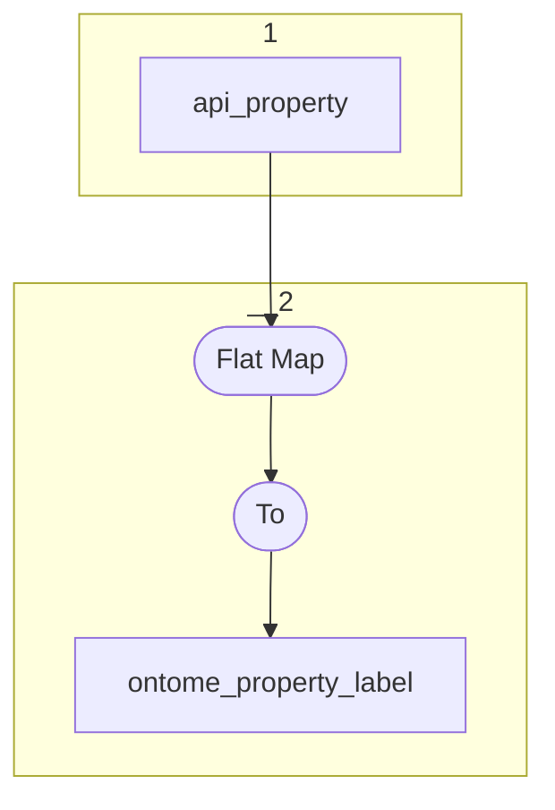

# Topology: Ontome Property Label

This topology generates ontome property labels, keyed by propertyId and languageId.

| Step |                                                                                                                                                                                       |
|------|---------------------------------------------------------------------------------------------------------------------------------------------------------------------------------------|
| 1    | input topics                                                                                                                                                                          |
| 2    | FlatMap each record to Key: PropertyId=`dfh_pk_property`, LanguageId=`id of dfh_property_label_language`; Value: `dfh_property_label`, LanguageId=`id of dfh_property_label_language` |
|      | To topic `ontome_property_label`                                                                                                                                                      |

## Input Topics

_{prefix_in} = TS_INPUT_TOPIC_NAME_PREFIX_

_{prefix_out} = TS_OUTPUT_TOPIC_NAME_PREFIX_

| name                                         | label in diagram | Type   |
|----------------------------------------------|------------------|--------|
| {input_prefix}_data_for_history_api_property | api_property     | KTable |

## Output topic

| name                                  | label in diagram      |
|---------------------------------------|-----------------------|
| {output_prefix}_ontome_property_label | ontome_property_label |

## Output model

| name  | description                              |
|-------|------------------------------------------|
| Key   | propertyId, languageId                   |
| Value | propertyId, languageId, label, __deleted |
