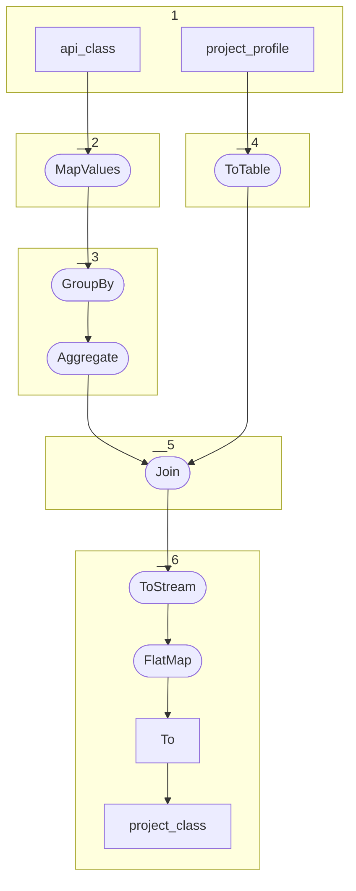

# Topology: Project Class

This topology creates project class relations.

| Step |                                                                                                                                                                                |
|------|--------------------------------------------------------------------------------------------------------------------------------------------------------------------------------|
| 1    | input topics                                                                                                                                                                   |
| 2    | MapValues: project the stream to ProfileClassyValue: profileId, classId, deleted                                                                                               |
| 3    | GroupBy profileId and Aggregate to a ClassyProfileMap, concatenating profileId and classId to a key and using ProfileClassyValue as value. This removes duplicates of classes. |
| 4    | ToTable                                                                                                                                                                        |
| 5    | Join: KTable-KTable-Foreign-key-Join on profileId                                                                                                                              |
| 6    | ToStream: convert table to a stream; FlatMap: Flatten aggregated classes to project-class messages; To: Write to topic project_class                                           |

## Input Topics

_{prefix_in} = TS_INPUT_TOPIC_NAME_PREFIX_

_{prefix_out} = TS_OUTPUT_TOPIC_NAME_PREFIX_

| name                                   | label in diagram | Type    |
|----------------------------------------|------------------|---------|
| {prefix_in}.data_for_history.api_class | api_class        | KTable  |
| {prefix_out}.project_profile           | project_profile  | KStream |

## Output topic

| name                   | label in diagram |
|------------------------|------------------|
| {prefix}.project_class | project_class    |

## Output model

| name  | description                   |
|-------|-------------------------------|
| Key   | projectId, classId,           |
| Value | projectId, classId, __deleted |
