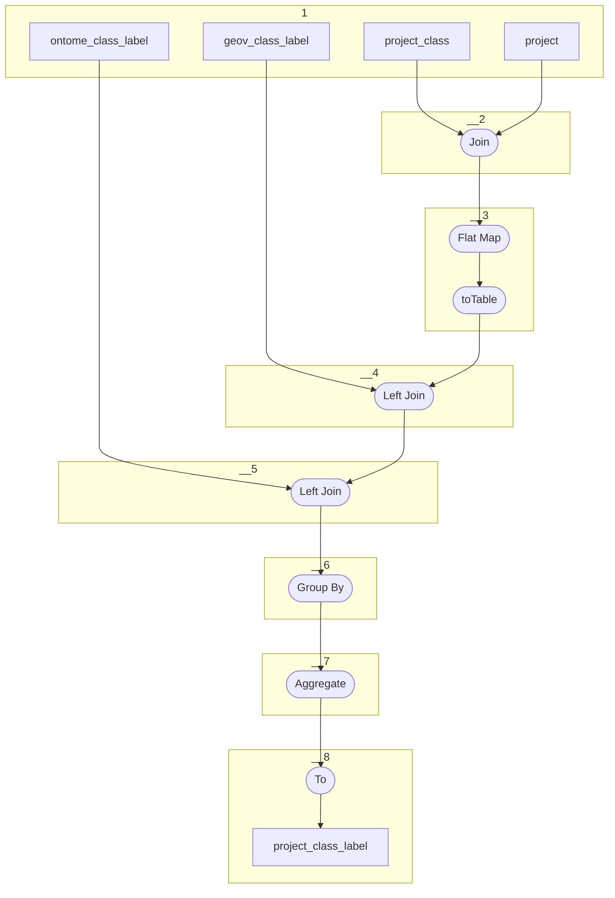

# Topology: ProjectClassLabel

This topology generates project labels of properties.

For each project-class, the first label present in the following list is used:

- Label in project language, provided by Geovistory project
- Label in project language, provided by Geovistory default project
- Label in project language, provided by OntoME
- Label in english, provided by Geovistory project
- Label in english, provided by Geovistory default project
- Label in english, provided by OntoME

To achieve this, the topology joins `project_class` with `project`, `text_property` and `api_class`.

- `project_class`: For each record in this topic two labels are generated: the outgoing and the ingoing label.
- `project` Provides the language of a project.
- `text_property` provides the Geovistory (default) project labels
- `api_class` provides the OntoME labels

| Step |                                                                                                                                                                                                                                                                  |
|------|------------------------------------------------------------------------------------------------------------------------------------------------------------------------------------------------------------------------------------------------------------------|
| 1    | input topics                                                                                                                                                                                                                                                     |
| 2    | Join on `projectId = project.pk_entity`; enrich the value of `project_class` by `project.fk_language` as `languageId`                                                                                                                                            |
| 3    | Flat Map: for each input record class and where `languageId` not en `18889` add a duplicate with `18889`, and where projectId not `375669` add a duplicate with `375669` resulting in 2 or 4 out records per input record. Keys: ProjectId, ClassId , LanguageId |                                                           |
| 4    | Left Join `text_property` on keys                                                                                                                                                                                                                                |
| 5    | Left Join on keys                                                                                                                                                                                                                                                |
| 6    | Group By  ProjectId, ClassId                                                                                                                                                                                                                                     |
| 7    | Aggregate picking the label as defined above                                                                                                                                                                                                                     |
| 8    | To topic `project_class_label`                                                                                                                                                                                                                                   |

## Input Topics

_{prefix_in} = TS_INPUT_TOPIC_NAME_PREFIX_

_{prefix_out} = TS_OUTPUT_TOPIC_NAME_PREFIX_

| name                               | label in diagram   | Type   |
|------------------------------------|--------------------|--------|
| {output_prefix}_ontome_class_label | ontome_class_label | KTable |
| {output_prefix}_geov_class_label   | geov_class_label   | KTable |
| {input_prefix}_projects_project    | project            | KTable |
| {output_prefix}_project_class      | project_class      | KTable |

## Output topic

| name                                | label in diagram    |
|-------------------------------------|---------------------|
| {output_prefix}_project_class_label | project_class_label |

## Output model

| name  | description                                      |
|-------|--------------------------------------------------|
| Key   | projectId, classId                               |
| Value | projectId, classId, label, languageId, __deleted |
