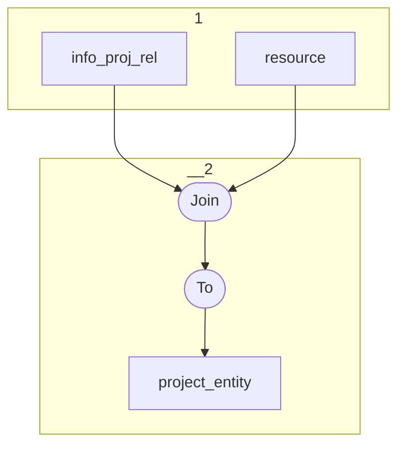

# Topology: ProjectClassLabel

This topology generates project entities by projectId and entityId.

| Step |                                                                                                                                                                                                                                                                              |
|------|------------------------------------------------------------------------------------------------------------------------------------------------------------------------------------------------------------------------------------------------------------------------------|
| 1    | input topics                                                                                                                                                                                                                                                                 |
| 2    | Flat Map: keep only records with `fk_dfh_class` and `fk_system_type = 639`,  Key: ClassId=`fk_dfh_class`, ProjectId=`fk_pro_project`, LanguageId=`fk_language`,  Value: ClassId=`fk_dfh_class`, ProjectId=`fk_pro_project`, LanguageId=`fk_language`, Label=`string` |
|      | To topic `project_class_label`                                                                                                                                                                                                                                               |

## Input Topics

_{prefix_in} = TS_INPUT_TOPIC_NAME_PREFIX_

_{prefix_out} = TS_OUTPUT_TOPIC_NAME_PREFIX_

| name                                  | label in diagram | Type   |
|---------------------------------------|------------------|--------|
| {input_prefix}_projects_info_proj_rel | info_proj_rel    | KTable |
| {input_prefix}_information_resource   | resource         | KTable |

## Output topic

| name                           | label in diagram |
|--------------------------------|------------------|
| {output_prefix}_project_entity | project_entity   |

## Output model

| name  | description                             |
|-------|-----------------------------------------|
| Key   | projectId, entityId                     |
| Value | projectId, entityId, classId, __deleted |
