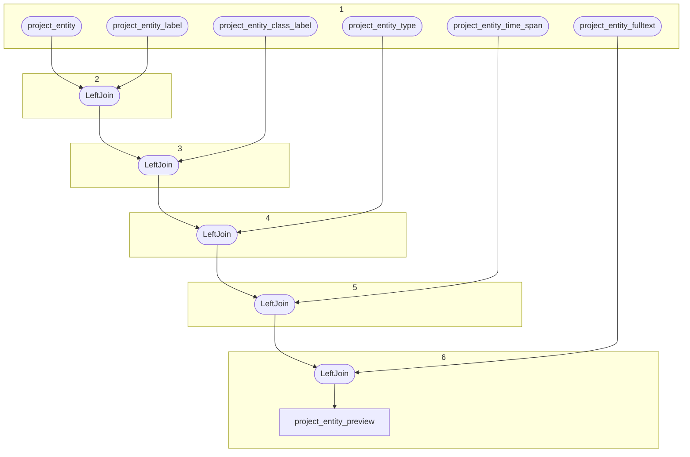

# Topology: ProjectEntityPreview

| Step |                                             |
|------|---------------------------------------------|
| 1    | input topics                                |
| 2-6  | LeftJoin on keys, value: EntityPreviewValue |

## Input Topics

_{prefix_out} = TS_OUTPUT_TOPIC_NAME_PREFIX_

| name                                  | label in diagram         | Type   |
|---------------------------------------|--------------------------|--------|
| {prefix_out}_project_entity           | project_entity           | KTable |
| {prefix_out}_project_entity_label     | project_entity_label     | KTable |
| {prefix_out}_project_entity_type      | project_entity_type      | KTable |
| {prefix_out}_project_entity_time_span | project_entity_time_span | KTable |
| {prefix_out}_project_entity_fulltext  | project_entity_fulltext  | KTable |

## Output topic

| name                                    | label in diagram        |
|-----------------------------------------|-------------------------|
| {output_prefix}_project__entity_preview | _project_entity_preview |

## Output model

### Key: ProjectEntityKey

| field      | type   |
|------------|--------|
| project_id | int    |
| entity_id  | string |

### Value: EntityPreviewValue

| field        | type          |
|--------------|---------------|
| fk_project   | int, null     |
| project      | int           |
| pk_entity    | string        |
| fk_class     | int, null     |
| fk_type      | string, null  |
| entity_label | string, null  |
| class_label  | string, null  |
| type_label   | string, null  |
| entity_type  | string, null  |
| full_text    | string        |
| time_span    | string, null  |
| first_second | bigint, null  |
| last_second  | bigint, null  |
| __deleted    | boolean, null |