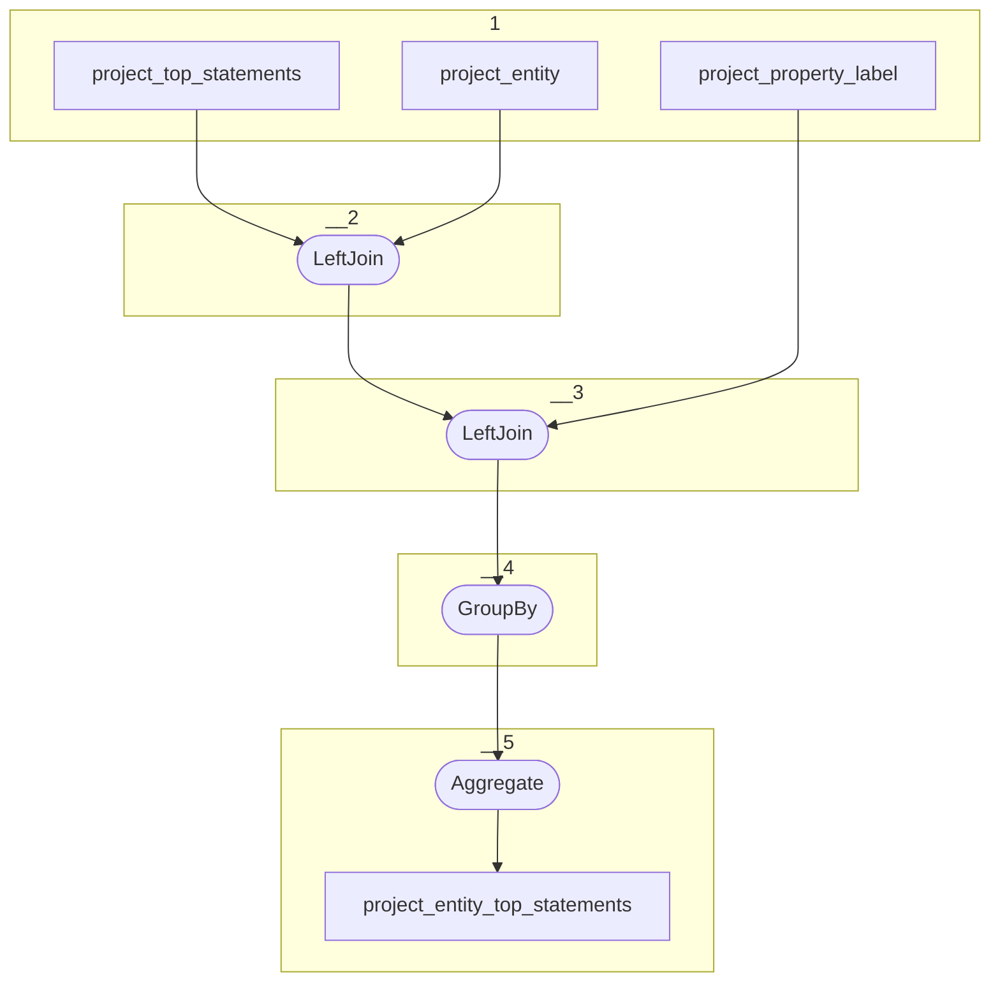

# Topology: ProjectEntityTopStatements

This topology aggregates the top statements of project entities, by projectId and entityId.

| Step |                                                                                               |
|------|-----------------------------------------------------------------------------------------------|
| 1    | input topics                                                                                  |
| 2    | LeftJoin join the project entity with the top statements to add the entity class to ProjectTopStatementsWithClass |
| 3    | LeftJoin join the property label with the top statements to ProjectTopStatementsWithPropLabelValue |
| 4    | GroupBy ProjectEntityKey |
| 5    | Aggregate ProjectEntityTopStatementsValue, where the ProjectTopStatementKey is transformed to a string, to be used as key in a map.                   |

## Input Topics

_{prefix_in} = TS_INPUT_TOPIC_NAME_PREFIX_

_{prefix_out} = TS_OUTPUT_TOPIC_NAME_PREFIX_

| name                                              | label in diagram                     | Type   |
|---------------------------------------------------|--------------------------------------|--------|
| {prefix_out}_project_top_statements | project_top_statements | KTable |

## Output topic

| name                                 | label in diagram     |
|--------------------------------------|----------------------|
| {output_prefix}_project_entity_top_statements | project_entity_top_statements  |

## Output model

### Key: ProjectEntityKey

| field      | type   |
|------------|--------|
| project_id | int    |
| entity_id  | string |

### Value ProjectEntityTopStatementsValue

| field      | type          |
|------------|---------------|
| project_id | int           |
| entity_id  | string        |
| map      | Map<String, ProjectTopStatementsWithPropLabelValue>        |
| __deleted  | boolean, null |
