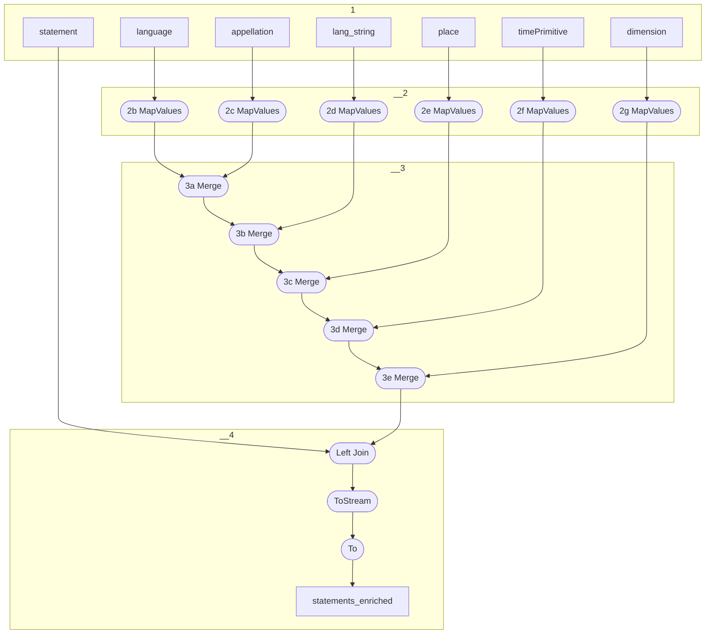

# Topology: Statement Enriched

This topology enriches statements with their literal values.

| Step |                                                              |
|------|--------------------------------------------------------------|
| 1    | input topics                                                 |
| 2    | MapValues to  StatementObject                                |
| 3    | merge streams enriching StatementObject                      |
| 4    | Left join statement objects with statement on fk_object_info |

class StatementObject

| property | type                 |
|----------|----------------------|
| classId  | Integer              |
| label    | String               |
| value    | StatementObjectValue |

class StatementObjectValue

| property      | type                        |
|---------------|-----------------------------|
| language      | null, InfLanguageValue      |
| appellation   | null, InfAppellationValue   |
| langString    | null, InfLangStringValue    |
| place         | null, InfPlaceValue         |
| timePrimitive | null, InfTimePrimitiveValue |
| dimension     | null, InfDimension          |

## Input Topics

_{prefix_in} = TS_INPUT_TOPIC_NAME_PREFIX_

_{prefix_out} = TS_OUTPUT_TOPIC_NAME_PREFIX_

| name                                  | label in diagram | Type   |
|---------------------------------------|------------------|--------|
| {input_prefix}_projects_info_proj_rel | info_proj_rel    | KTable |
| {input_prefix}_information_resource   | resource         | KTable |

## Output topic

| name                               | label in diagram   |
|------------------------------------|--------------------|
| {output_prefix}_statement_enriched | statement_enriched |

## Output model

### Key

| field      | type |
|------------|------|
| subjectId  | int  |
| propertyId | int  |
| objectId   | int  |

### Value

| field       | type            |
|-------------|-----------------|
| subjectId   | int             |
| propertyId  | int             |
| objectId    | int             |
| objectValue | StatementObject |
| deleted     | boolean, null   |

